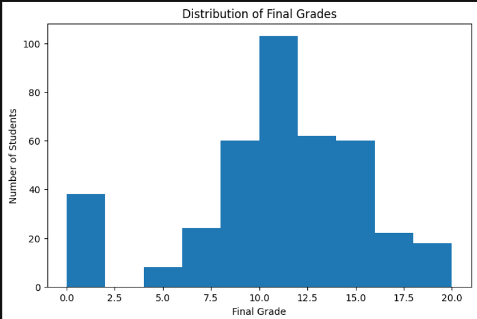
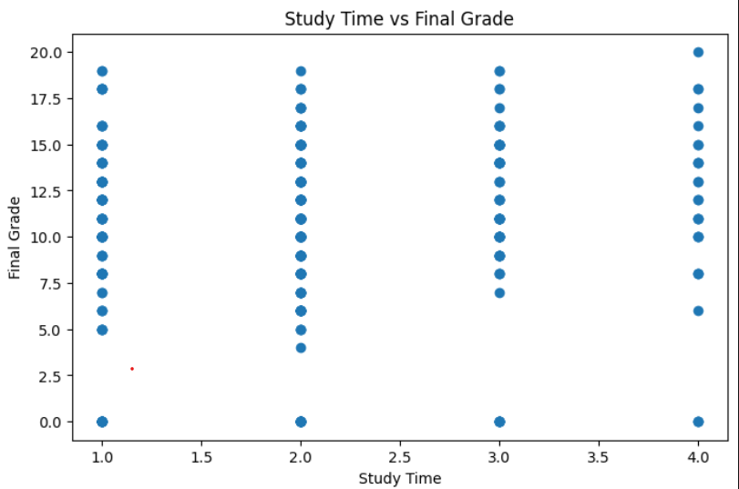
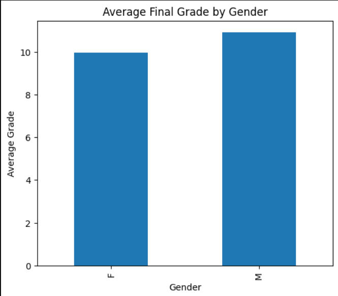
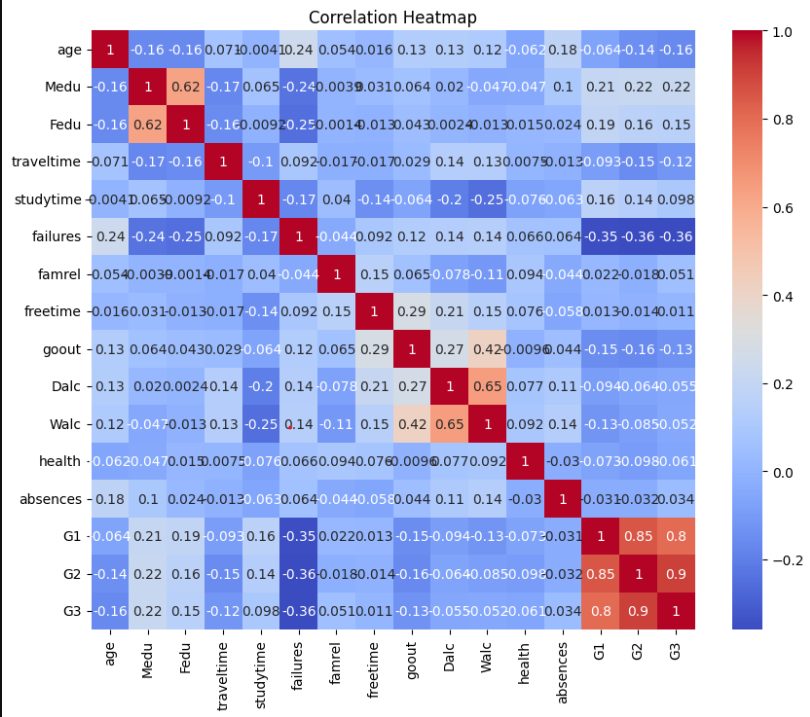

# Student Performance Analysis

## Submitted By
**Sakshi Keware**

## Project Objective

The objective of this project is to analyze student performance data using Python libraries such as Pandas, Matplotlib, and Seaborn.

## Tools and Technologies Used

- Python
- Pandas
- Matplotlib
- Seaborn
- Jupyter Notebook

## Project Steps

1. Data Loading
2. Data Exploration
3. Data Cleaning
4. Statistical Analysis
5. Data Visualization
6. Result Interpretation

## Dataset

The project uses the Student Performance dataset (`student-mat.csv`).

## Visualizations

### Histogram of Final Grades

### Scatter Plot: Study Time vs Final Grade

### Bar Chart: Average Final Grade by Gender

### Correlation Heatmap

## Conclusion

- Study time has a positive impact on student performance.
- Most students scored between 8 and 14 marks.
- The dataset contained no duplicate values.
- Female students performed slightly better on average.
